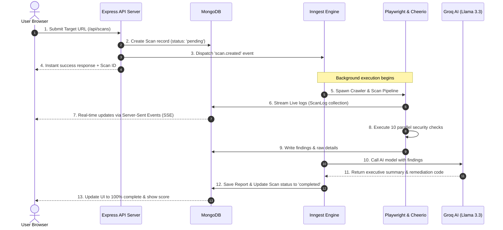

# SentinelScan 🛡️ — Web Application Vulnerability Scanner

SentinelScan is a production-ready, full-stack, asynchronous web security vulnerability scanner. It features a modern dark-themed dashboard, an event-driven background processing pipeline powered by Inngest, high-fidelity security audit modules running in parallel, and AI-driven report compilation & chat assistance leveraging Groq LLMs.

---

## 🏗️ Architecture & Data Flow

SentinelScan uses an asynchronous, decoupled, event-driven architecture to ensure web scanning processes do not block the main Express.js HTTP thread. Below is the workflow diagram showing how a scan moves through the system:



---

## 🔍 The 10 Specialized Security Modules

Every scan target goes through 10 distinct, specialized audit modules. The pipeline is constructed to run these modules concurrently using `Promise.allSettled()`. If one module fails or encounters an edge case, it is logged, and the rest of the scan continues unaffected.

| # | Security Module | Technical Summary | Key Checks Performed |
|---|---|---|---|
| **1** | **Web Crawler** | Recursively walks the target domain following internal links using Cheerio HTML parsing. | Internal links, form enumeration, asset mapping, depth/page limits. |
| **2** | **Security Headers** | Inspects response headers to verify correct implementation of modern browser protection policies. | Content-Security-Policy (CSP), HSTS, X-Frame-Options, Referrer-Policy, CORS. |
| **3** | **Cookie Attributes** | Analyzes `Set-Cookie` directives across all crawled pages to verify flag settings. | `HttpOnly` flag, `Secure` flags, `SameSite` attribute configuration. |
| **4** | **SSL/TLS Certificate** | Evaluates the validity, authority, and duration of the HTTPS certificate chain. | Expiry timing, HTTPS redirection enforcement, TLS handshake validation. |
| **5** | **Robots.txt Analysis** | Parses directives to locate files or paths marked as excluded from index engines. | Exposed admin panels, hidden config directories, backup assets. |
| **6** | **Clickjacking Auditor** | Verifies frame-embedding configurations that protect users from UI redressing attacks. | Frame-ancestors directive, X-Frame-Options headers. |
| **7** | **CORS Configuration** | Probes CORS preflight options with dynamic origins to identify insecure credential bindings. | Wildcard origins (`*`), reflected origins, credential leaks. |
| **8** | **Directory Scanner** | Audits target files against a directory wordlist containing common exposed interfaces. | `/admin`, `/wp-admin`, `/.git`, `/.env`, `/backup`, `/phpmyadmin`. |
| **9** | **Information Leakage** | Scans response source and HTTP headers for version disclosures and server banners. | `Server` headers, `X-Powered-By` signatures, developer comments, stack traces. |
| **10** | **Playwright Headless** | Spawns a headless Chromium instance to crawl and scrape single-page applications. | Dynamic single-page applications, dynamic DOM modifications, JS-injected links. |

---

## 🛠️ Tech Stack

- **Frontend**: React SPA (Vite), Tailwind CSS, DaisyUI (Forest/Light themes), Zustand (state management), Lucide React, Recharts (visual statistics), and jsPDF.
- **Backend**: Node.js (ESM), Express.js, Helmet, CORS, Cookie-Parser, Mongoose, and Passport.js.
- **Job Engine**: Inngest SDK (local dev environment via CLI, production via Inngest Cloud).
- **AI Integrations**: Groq SDK (`llama-3.3-70b-versatile`) for summary generation and Q&A chat.
- **Database**: MongoDB.

---

## 🚀 Getting Started

### Prerequisites
- Node.js (v18+)
- MongoDB Atlas cluster or a local MongoDB database instance
- Groq API Key (for report generation and AI assistant)

---

### Configuration & Environments

Create a `.env` file in the `backend/` directory:

```env
PORT=5000
MONGODB_URI=mongodb+srv://<username>:<password>@cluster.mongodb.net/sentinelscan
JWT_SECRET=your_super_secret_jwt_key
CLIENT_URL=http://localhost:5173
GROQ_API_KEY=gsk_your_groq_api_key

# Google OAuth Setup (Optional)
GOOGLE_CLIENT_ID=your_google_client_id.apps.googleusercontent.com
GOOGLE_CLIENT_SECRET=GOCSPX-your_google_client_secret

# Inngest Dev Server Configuration (Optional for local development)
# INNGEST_BASE_URL=http://127.0.0.1:8288
```

Create a `.env` file in the `client/` directory:

```env
VITE_API_URL=http://localhost:5000/api
```

---

### Installation Instructions

1. **Clone the Repository**:
   ```bash
   git clone https://github.com/your-username/web-security-scanner.git
   cd web-security-scanner
   ```

2. **Install Backend Dependencies**:
   ```bash
   cd backend
   npm install
   ```

3. **Install Frontend Dependencies**:
   ```bash
   cd ../client
   npm install
   ```

4. **Install Headless Playwright Browser**:
   ```bash
   npx playwright install chromium
   ```

---

### Local Development Startup

SentinelScan operates fully when the Backend, Frontend, and Inngest Dev Server run simultaneously.

1. **Start the Inngest Dev Server** (in a dedicated terminal):
   ```bash
   npx inngest-cli@latest dev -u http://localhost:5000/api/inngest
   ```

2. **Start the Express API Server**:
   ```bash
   cd backend
   npm run dev
   ```

3. **Start the React Frontend Client**:
   ```bash
   cd client
   npm run dev
   ```

4. Open `http://localhost:5173` in your browser.

---

## 🔒 Security Practices & Fallbacks
* **CORS Settings**: The backend configures CORS policy using the `CLIENT_URL` environment parameter.
* **Inngest Resiliency**: If the Inngest runner is down or unreachable during development, SentinelScan falls back gracefully to a non-blocking in-process thread using `setImmediate()`, ensuring you can still run security audits locally without background queue infrastructure.
* **Security Headers**: Standard security headers (CSP, HSTS, X-Content-Type-Options) are enforced on the API endpoints using Helmet.

---
🛡️ *SentinelScan — Enterprise web application audits, simplified.*
